## **AC215 - MILESTONE 6 - CYBERSAFE**

**TEAM MEMBERS**
- Rob Chavez
- Naina Garg
- Qian Liu
- Daniel More Torres
- Sophia Yang (She/Her)

  
## **PROJECT DESCRIPTION & LINKS**

1.  **Live website**: [Click here!](https://github.io/rob-chavez/ac2152023_cybersafe/)
2.  **5-minute Video**: [Click here!](https://youtube.com)
3.  **Project Presentation**: [click here!](https://docs.google.com/presentation/d/1VH4gDZcp9iWqPinPQEvCn5YSBc5Rclc99ygzw3jh1jo/edit?pli=1#slide=id.g2a1c3fb0b67_0_494)
4.  **Medium Blog**: [click here!](https://medium.com/institute-for-applied-computational-science/ac215-fall2021-projects/home)
5.  **GitHub Repository**: The repository named `milestone6` contains functional code for both the APIs and the front-end interface. All code, documentation, and relevant assets are published in this GitHub repository, with well-structured instructions to aid replication and/or learning from our project.
    [Click here!](https://github.io/rob-chavez/ac2152023_cybersafe/)

<p align="center">
  
</p>


<br>


PROJECT ORGANIZATION
--------------------
```
        ├── LICENSE
        ├── README.md
        ├── dga-classifier-app-v1 <--- Where our app is stored
        │   ├── LICENSE
        │   ├── images
        │   └── src
        │       ├── api-service
        │       │   ├── Dockerfile
        │       │   ├── Pipfile
        │       │   ├── Pipfile.lock
        │       │   ├── api
        │       │   │   ├── model.py
        │       │   │   ├── service.py
        │       │   │   ├── tracker.py
        │       │   │   └── vertexAImodel.py   <---- WE DECIDED TO USE VERTEX AI ENDPOINT FOR THIS MILESTONE
        │       │   ├── docker-entrypoint.sh
        │       │   ├── docker-shell.bat
        │       │   └── docker-shell.sh
        │       ├── deployment
        │       │   ├── Dockerfile
        │       │   ├── deploy-*.yml files
        │       │   ├── docker-entrypoint.sh
        │       │   ├── docker-shell.bat
        │       │   ├── docker-shell.sh
        │       │   ├── inventory.yml
        │       │   └── nginx-conf
        │       │       └── nginx
        │       │           └── nginx.conf
        │       ├── frontend-react
        │       │   ├── Dockerfile
        │       │   ├── Dockerfile.dev
        │       │   ├── conf.d
        │       │   │   └── default.conf
        │       │   ├── docker-shell.bat
        │       │   ├── docker-shell.sh
        │       │   ├── package.json
        │       │   ├── public
        │       │   │   ├── index.html
        │       │   │   └── manifest.json
        │       │   ├── src
        │       │   │   ├── app
        │       │   │   │   ├── App.css
        │       │   │   │   ├── App.js
        │       │   │   │   └── App.test.js
        │       │   │   ├── components
        │       │   │   ├── index.css
        │       │   │   ├── index.js
        │       │   │   ├── services
        │       └── frontend-simple
        │           ├── Dockerfile
        │           ├── docker-shell.bat
        │           ├── docker-shell.sh
        │           ├── index.html
        ├── images
        ├── notebooks
        │   ├── EDA_and_Model.ipynb
        │   ├── model.ipynb
        │   ├── model_CNN_LSTM.ipynb
        │   └── tree_bert_based_experiments.ipynb
        ├── persistent
        │   └── experiments
        ├── references
        │   └── Chin2018_Chapter_AMachineLearningFrameworkForSt.pdf
        ├── reports
        │   ├── images
        │   ├── milestone2.md
        │   └── milestone3.md
        │   ├── milestone4.md
        └── src
            ├── deploy_model
            │   ├── Dockerfile
            │   ├── docker-shell.sh
            │   ├── handler.py     <------ HANDLER FOR DEPLOYING PYTORCH MODEL TO VERTEX AI
            │   ├── predict.py
            │   └── stage.py
            ├── etl
            │   ├── extracts
            │   │   ├── Dockerfile
            │   │   ├── Pipfile
            │   │   ├── Pipfile.lock
            │   │   ├── README.md
            │   │   ├── docker-compose.yml
            │   │   ├── docker-entrypoint.sh
            │   │   ├── docker-shell.sh
            │   │   ├── extract.py
            │   │   ├── extract.sh
            │   │   └── images
            │   ├── format
            │   │   ├── Dockerfile
            │   │   ├── Pipfile
            │   │   ├── Pipfile.lock
            │   │   ├── README.md
            │   │   ├── docker-compose.yml
            │   │   ├── docker-entrypoint.sh
            │   │   ├── docker-shell.sh
            │   │   ├── format.py
            │   │   └── images
            │   └── preprocess
            │       ├── Dockerfile
            │       ├── Pipfile
            │       ├── Pipfile.lock
            │       ├── README.md
            │       ├── docker-compose.yml
            │       ├── docker.sh
            │       ├── features.py
            │       ├── images
            │       └── preprocess.py
            ├── models
            │   ├── Dockerfile
            │   ├── Pipfile
            │   ├── Pipfile.lock
            │   ├── cli.py
            │   ├── docker-entrypoint.sh
            │   ├── docker-shell.sh
            │   ├── package
            │   │   ├── PKG-INFO
            │   │   ├── setup.cfg
            │   │   ├── setup.py
            │   │   └── trainer
            │   │       ├── __init__.py
            │   │       └── task.py
            │   └── package-trainer.sh
            ├── optimizations
            │   └── Quantization.ipynb
            ├── streamlit
            │   ├── Dockerfile
            │   ├── Pipfile
            │   ├── Pipfile.lock
            │   ├── cli.py
            │   ├── docker-compose.yml
            │   └── docker.sh
            └── workflow
                ├── Dockerfile
                ├── Pipfile
                ├── Pipfile.lock
                ├── cli.py
                ├── data_extractor.yaml
                ├── data_formator.yaml
                ├── data_trainer.yaml
                ├── docker-entrypoint.sh
                ├── docker-shell.sh
                ├── model.py
                └── pipeline.yaml
```

## **MILESTONE 6**

**Group Name**: CyberSafe

**Problem Definition**: CyberSafe is an application that identifies the actors associated with malicious domains produced by domain generating algorithms (DGA) using BERT-based models. This milestone culminates our project with the successful development and scaled deployment of the DGA classifier application.

## **Data Description**
After building a robust ML Pipeline and creating robust APIs (which utilize VERTEX AI's deployed model endpoint) that act as connectors between the front end and the back end, we have produced a scaled backend API service and frontend app. This is our client-facing application that ties together the various components developed during the last five milestones.

**DGA CLASSIFIER APP**

We built a user-friendly React app to identify domains produced by domain generating algorithms (DGA) using BERT-based models. While using the app, you can enter a domain manually or upload a text file with domain names; our app will return to the backend api to get prediction results with the name of the actor as well as specify whether the domain is legit or illegit.

1. **Scaling with Kubernetes**:
   - CyberSafe is a structured application with user accessibility through intuitve interaction and functionality built on a solid code structure. We refined our frontend and backend by expanding it with the Kubernetes-based scaling solution so that the application can handle real-world scenarios and peak loads efficiently. Ansible scripts helped us manage creating and updating the k8s cluster by managing infrastructure as code and keeping track of our app infrastructure as code in GitHub. which helped use setup deployments in a very automated way.
  
   - Here is our deployed app on a K8s cluster in the Google Cloud Platform (GCP):
     
     
2. **Deployment Plan and Execution with Ansible**:
   - Ansible provided an automated deployment solution with creating, setting up, and launching both the frontend and backend of our application on GCP. Our application has streamlined deployment processes and configuration management with consistency across different environments.
   - The user can find below our documented deployment plan, along with evidence of successful deployment, including CI/CD pipelines, monitoring, and other deployment best practices.
<br>

## **TECHNICAL DETAILS: MILESTONE 6**
Here are the screenshots of our app:

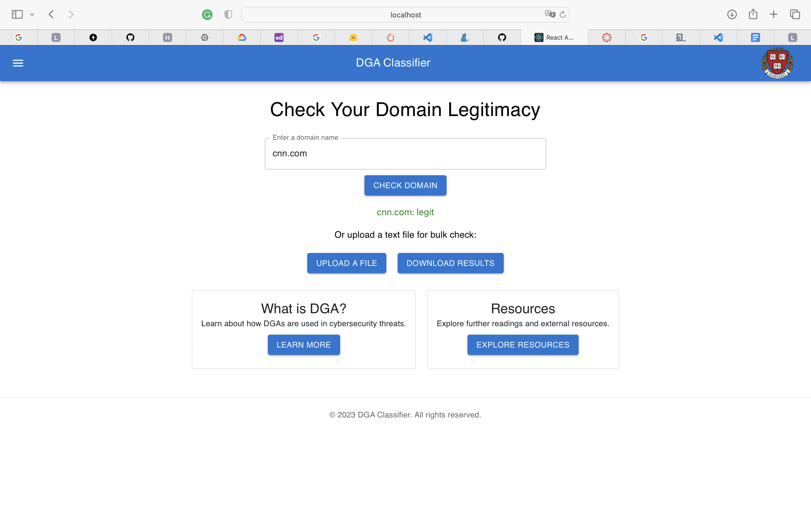

### **SCALING WITH KUBERNETES**

   - Our frontend and backend is deployed to a kubernetes cluster to ensure load balancing and failover with ansible scripts to manage creating and updating the k8s cluster. Here is our deployed app on a K8s cluster in GCP:


### **DEPLOYMENT WITH ANSIBLE**

Utilizing Ansible, we successfully deployed three containers:

- api-service
- frontend
- web-server

The steps involved were:
- Creation of the 3 containers
- Virtual Machine (VM) setup
- VM provisioning
- Containers deployment to the VM
- Running the web-server


### **DEPLOYMENT USING GITHUB ACTIONS**
Finally, we put all the components we built for our DGA Classifier App together. We applied Continuous Integration and Continuous Deployment (CI/CD) methods to test, execute, monitor, deploy, and scale these components. All of these steps are automated based on workflow using GitHub Actions to ensure we can trigger deployment or any other pipeline using GitHub Events. Our yaml files can be found under .github/workflows

cicdworkflow.yml - Brief description here

Here are the components we built for CyberSafe:

   - **Data Container**: Extracts data and stores them into a raw folder.
   - **Model Training**: Submits training jobs to Vertex AI to train models
   - **Model Deploy**: Updates trained models signature with preprocessing logic added to it. Upload model to Vertex AI Model Registry and Deploy model to Model Endpoints.
   - **API Service**: FastAPI service to expose APIs to the frontend.
   - **Frontend**: React Frontend for the DGA-Classifier app.

We implemented a CI/CD workflow to use the deployment container for the following reasons:

- Invoke docker image building and pushing to GCR on code changes
- Deploy the changed containers to update the k8s cluster
- Run Vertex AI jobs if needed


 ***************************

Here is what it's like for the `react` version:

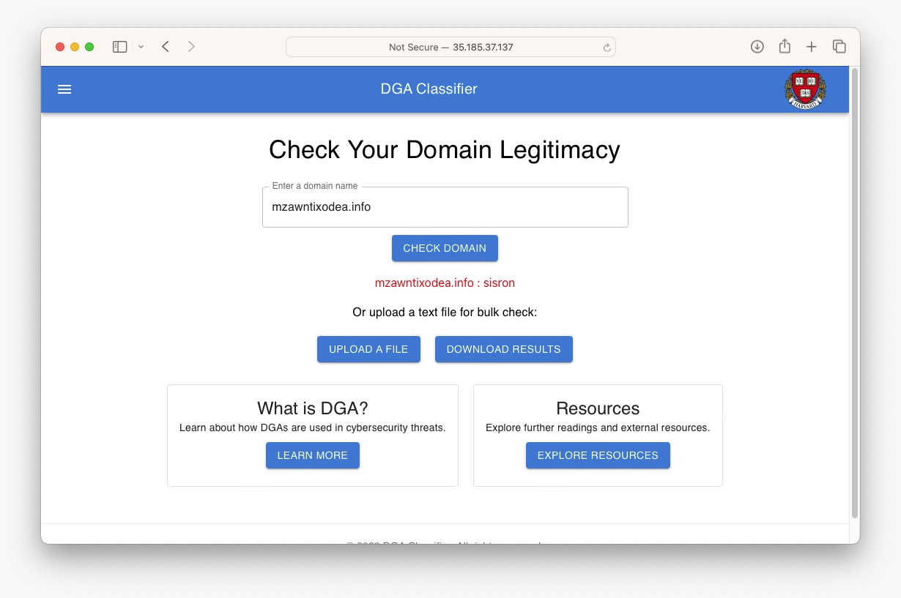

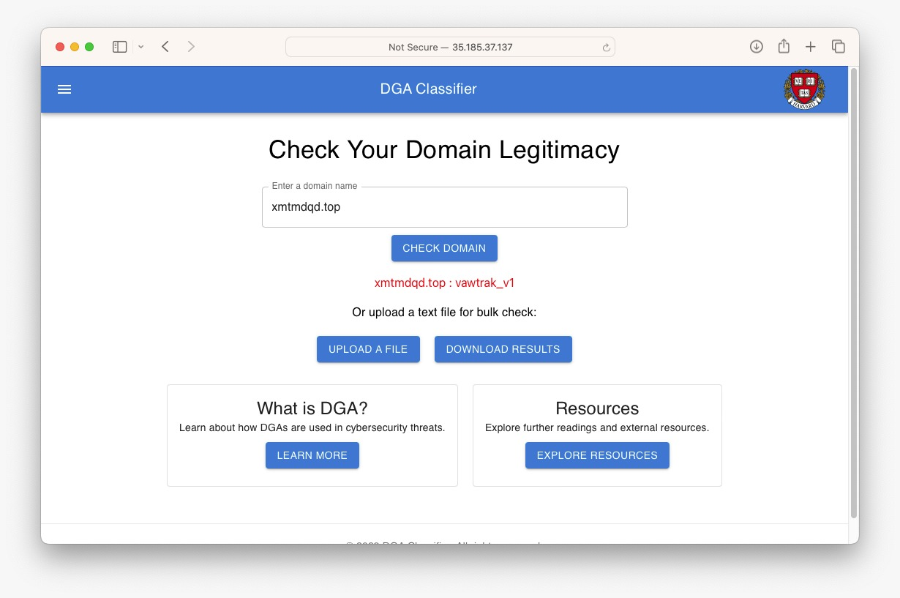


And here is what it's like for the `simple` version:

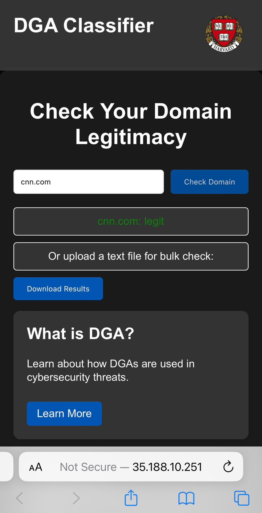


Note: Our APIs & Frontend Implmentation code is stored in `dga-classifier-app-v1` folder.

Our DGA Classifier app has three main parts in its structure:

- <b>api-service</b>
- <b>frontend-simple</b>
- <b>frontend-react</b>


#### APIs

##### Run api-service

The <b>api-service</b> contains four .py files: 

- <b>service.py</b>: Implement API service with FastAPI

- <b>tracker.py</b>: Download the best model (`bert_dga_classifier`). The downloaded model is stored in the `/persistent/experiments` folder.

- <b>model.py</b>: Loads the model for predictions

- <b>vertexAImodel.py</b>: Leverages VERTEX AI's endpoint for predictions.

There are two predict functions:

- `predict_manual_input`: Predict when the user enters a domain name manually

- `predict_from_file`: Predict when the user uploads a .txt file

To run the api-service container, use the following commands:

```
# Run the container locally 
cd /dga-classifier-app-v1/src/api-service
sh docker-shell.sh
uvicorn-server
```

Then access `http://localhost:9000/`

It shows a message: "{"message":"Welcome to the API Service"}".

If you navigate to `http://localhost:9000/docs#/`, you can see all the api services implemented:

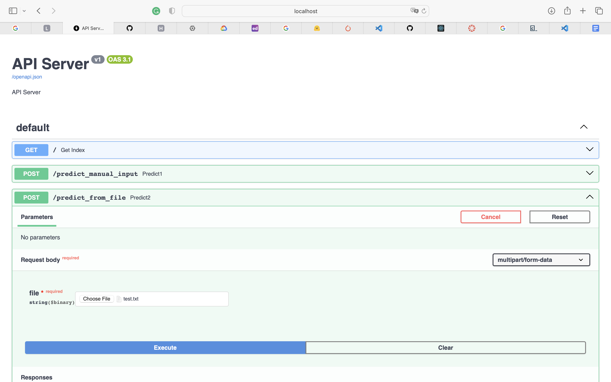

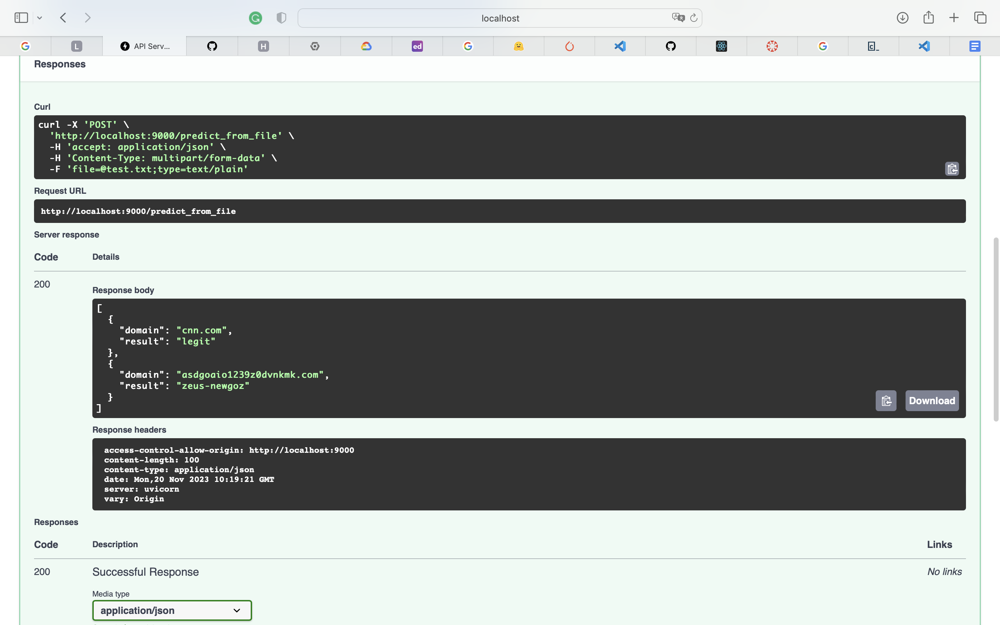

#### Frontend Implementation

We've built two frontend interfaces: frontend-react (using React) and frontend-simple (without React).


##### Run frontend-react

```
# Run the container locally 
cd /dga-classifier-app-v1/src/frontend-react
sh docker-shell.sh
yarn install
yarn start
```

Then go to `http://localhost:3000/`

You can test a domain name by entering it manually:


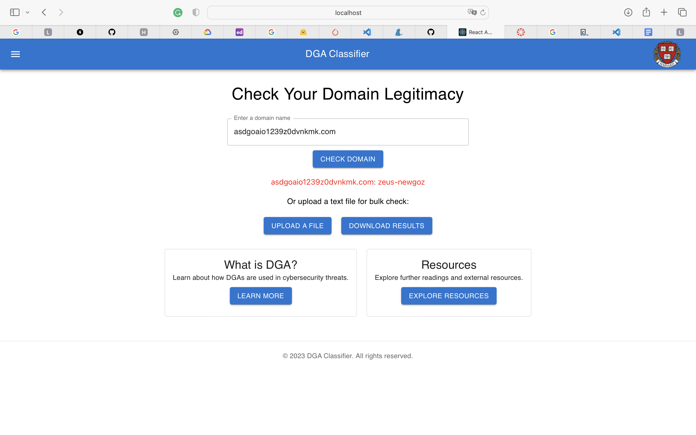

Alternatively you can upload a .txt file:

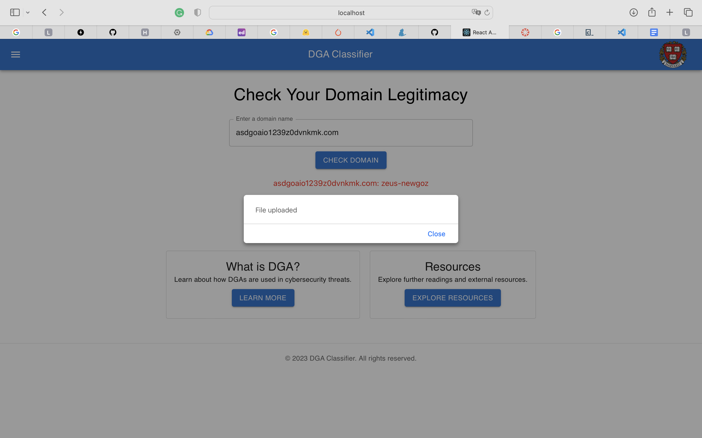

Note: An alert message will pop up if the user tries to upload a file that isn't .txt:


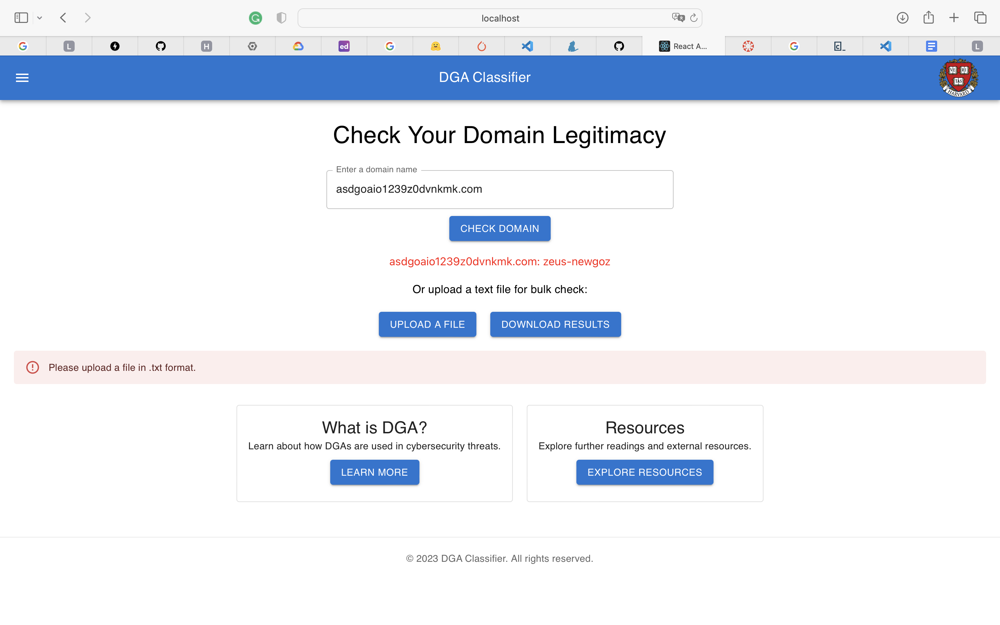

The result will be displayed in a .txt file in this format:


```
# Input
enn.com
asdgoaio1239z0dvnkmk.com
```

```
# Output
[
  {
    "domain": "cnn.com",
    "result": "legit"
  },
  {
    "domain": "asdgoaio1239z0dvnkmk.com",
    "result": "zeus-newgoz"
  }
]
```

##### Run frontend-simple

Frontend-simple is used as a prototype and another version for deployment:

```
# Run the container locally 
cd /dga-classifier-app-v1/src/frontend-simple
sh docker-shell.sh
http-server
```

Then go to `http://localhost:8080/`

You can test a domain name by entering it manually:

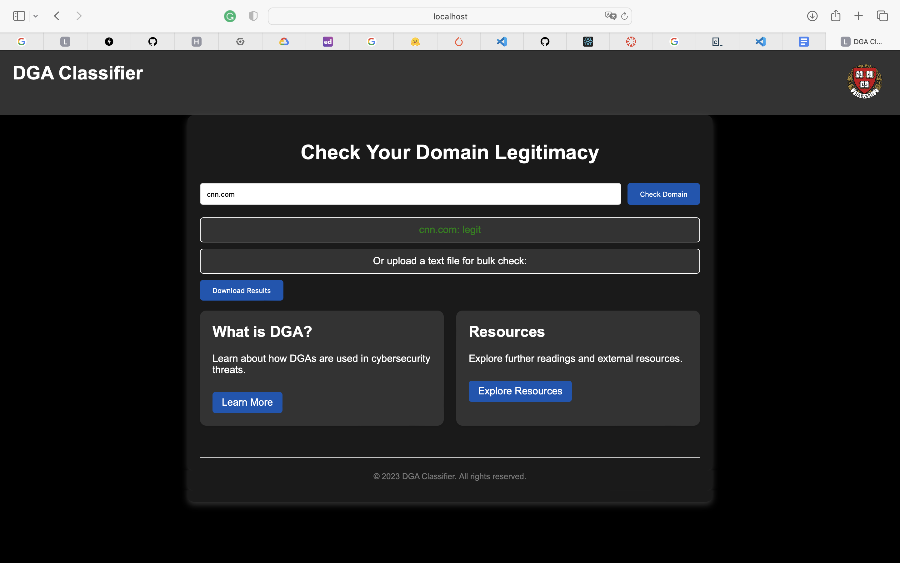

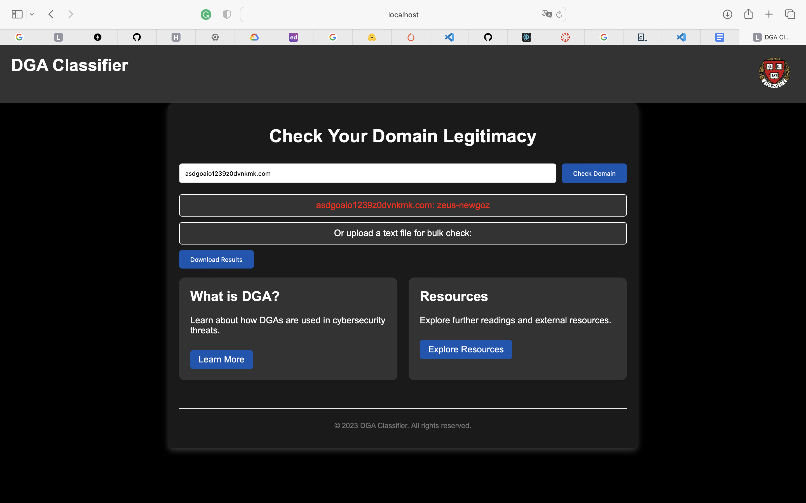

Again, the downloaded result will look like this:

```
[
  {
    "domain": "cnn.com",
    "result": "legit"
  },
  {
    "domain": "asdgoaio1239z0dvnkmk.com",
    "result": "zeus-newgoz"
  }
]
```
