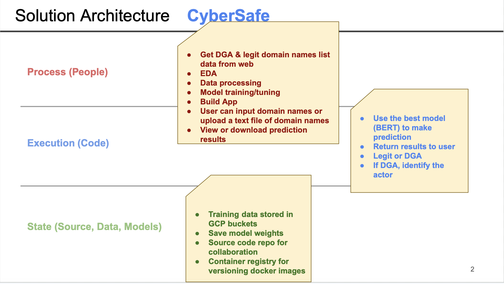
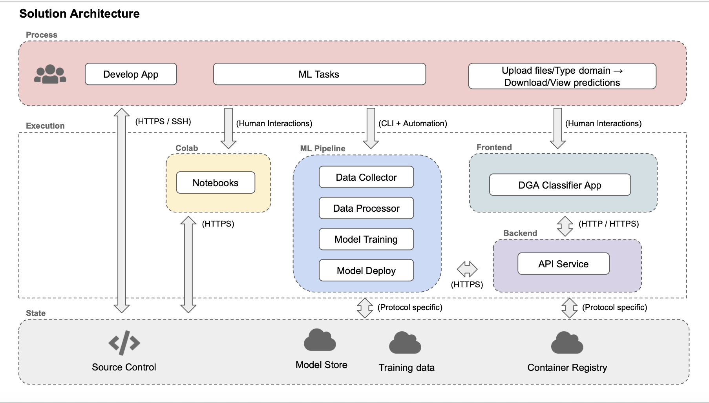
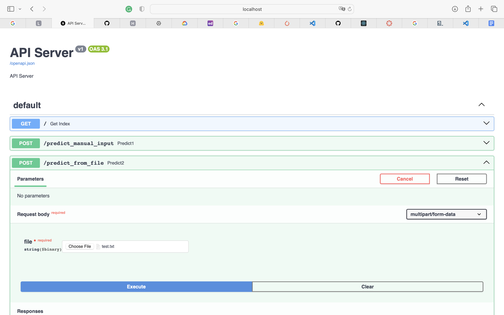
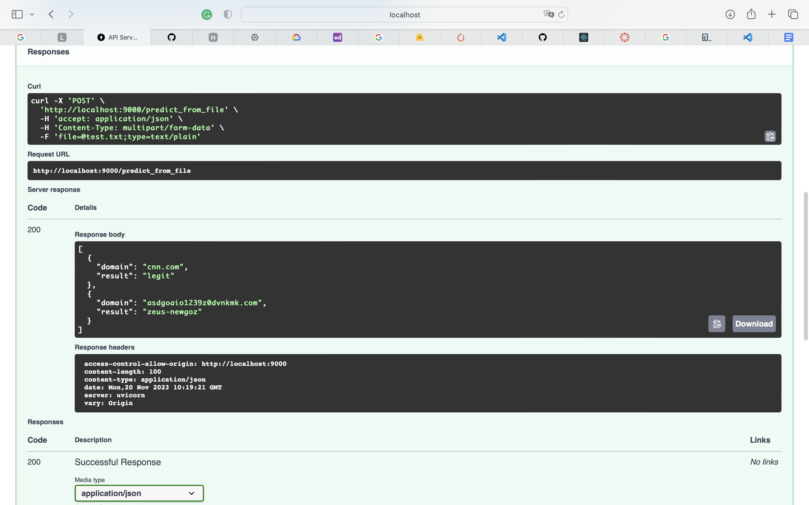
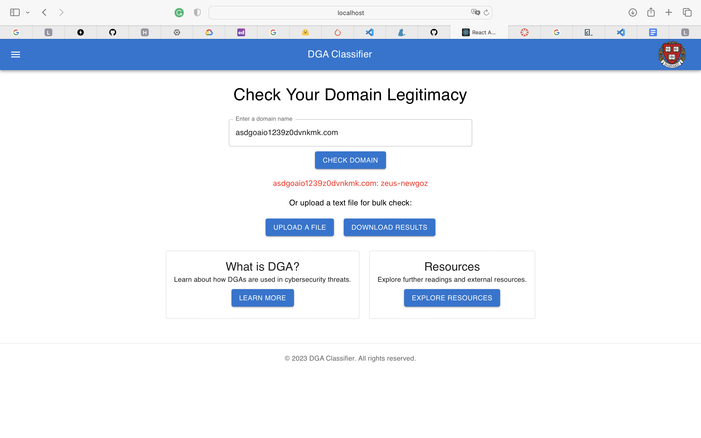
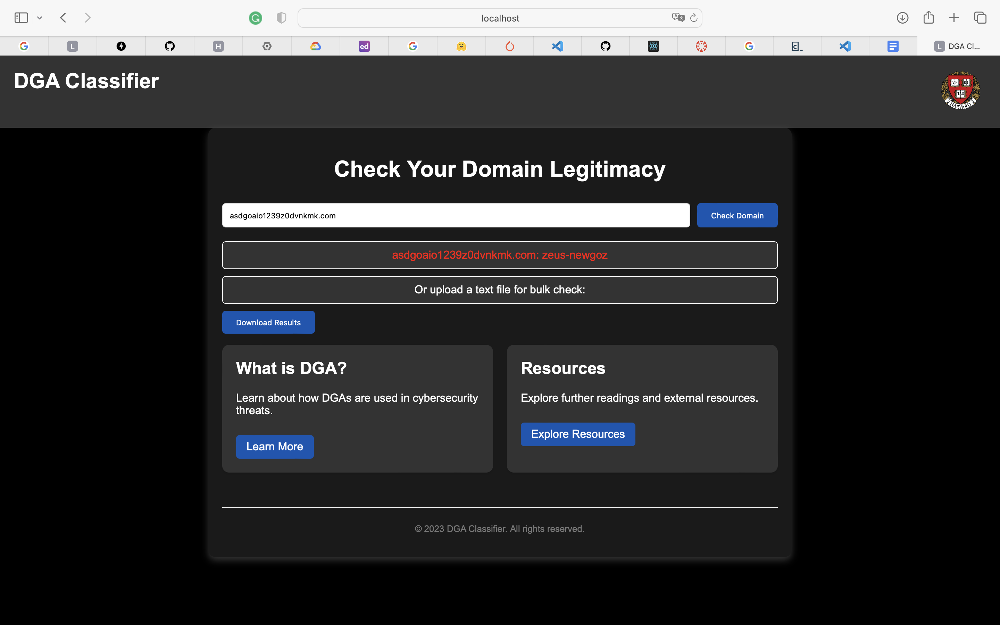
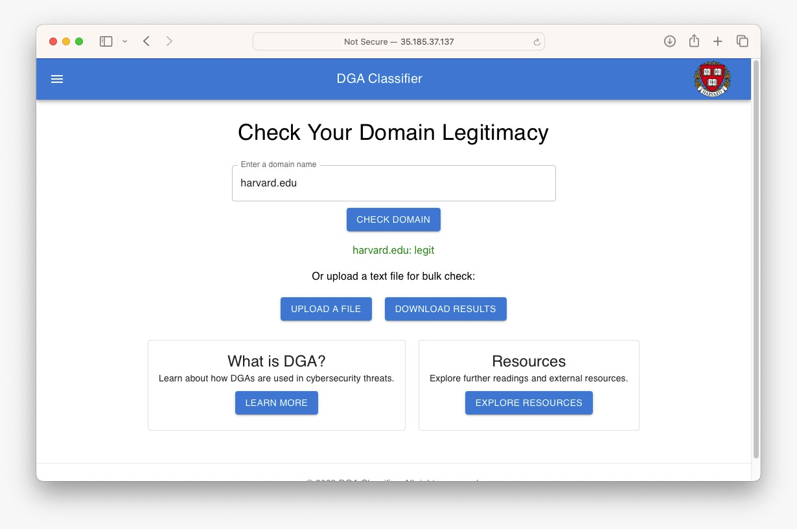

Project Organization
--------------------
```
        ├── LICENSE
        ├── README.md
        ├── dga-classifier-app-v1
        │   ├── LICENSE
        │   ├── images
        │   └── src
        │       ├── api-service
        │       │   ├── Dockerfile
        │       │   ├── Pipfile
        │       │   ├── Pipfile.lock
        │       │   ├── api
        │       │   │   ├── model.py
        │       │   │   ├── service.py
        │       │   │   ├── tracker.py
        │       │   │   └── vertexAImodel.py   <---- WE DECIDED TO USE VERTEX AI ENDPOINT FOR THIS MILESTONE
        │       │   ├── docker-entrypoint.sh
        │       │   ├── docker-shell.bat
        │       │   └── docker-shell.sh
        │       ├── deployment
        │       │   ├── Dockerfile
        │       │   ├── deploy-*.yml files
        │       │   ├── docker-entrypoint.sh
        │       │   ├── docker-shell.bat
        │       │   ├── docker-shell.sh
        │       │   ├── inventory.yml
        │       │   └── nginx-conf
        │       │       └── nginx
        │       │           └── nginx.conf
        │       ├── frontend-react
        │       │   ├── Dockerfile
        │       │   ├── Dockerfile.dev
        │       │   ├── conf.d
        │       │   │   └── default.conf
        │       │   ├── docker-shell.bat
        │       │   ├── docker-shell.sh
        │       │   ├── package.json
        │       │   ├── public
        │       │   │   ├── index.html
        │       │   │   └── manifest.json
        │       │   ├── src
        │       │   │   ├── app
        │       │   │   │   ├── App.css
        │       │   │   │   ├── App.js
        │       │   │   │   └── App.test.js
        │       │   │   ├── components
        │       │   │   ├── index.css
        │       │   │   ├── index.js
        │       │   │   ├── services
        │       └── frontend-simple
        │           ├── Dockerfile
        │           ├── docker-shell.bat
        │           ├── docker-shell.sh
        │           ├── index.html
        ├── images
        ├── notebooks
        │   ├── EDA_and_Model.ipynb
        │   ├── model.ipynb
        │   ├── model_CNN_LSTM.ipynb
        │   └── tree_bert_based_experiments.ipynb
        ├── persistent
        │   └── experiments
        ├── references
        │   └── Chin2018_Chapter_AMachineLearningFrameworkForSt.pdf
        ├── reports
        │   ├── images
        │   ├── milestone2.md
        │   └── milestone3.md
        │   ├── milestone4.md
        └── src
            ├── deploy_model
            │   ├── Dockerfile
            │   ├── docker-shell.sh
            │   ├── handler.py     <------ HANDLER FOR DEPLOYING PYTORCH MODEL TO VERTEX AI
            │   ├── predict.py
            │   └── stage.py
            ├── etl
            │   ├── extracts
            │   │   ├── Dockerfile
            │   │   ├── Pipfile
            │   │   ├── Pipfile.lock
            │   │   ├── README.md
            │   │   ├── docker-compose.yml
            │   │   ├── docker-entrypoint.sh
            │   │   ├── docker-shell.sh
            │   │   ├── extract.py
            │   │   ├── extract.sh
            │   │   └── images
            │   ├── format
            │   │   ├── Dockerfile
            │   │   ├── Pipfile
            │   │   ├── Pipfile.lock
            │   │   ├── README.md
            │   │   ├── docker-compose.yml
            │   │   ├── docker-entrypoint.sh
            │   │   ├── docker-shell.sh
            │   │   ├── format.py
            │   │   └── images
            │   └── preprocess
            │       ├── Dockerfile
            │       ├── Pipfile
            │       ├── Pipfile.lock
            │       ├── README.md
            │       ├── docker-compose.yml
            │       ├── docker.sh
            │       ├── features.py
            │       ├── images
            │       └── preprocess.py
            ├── models
            │   ├── Dockerfile
            │   ├── Pipfile
            │   ├── Pipfile.lock
            │   ├── cli.py
            │   ├── docker-entrypoint.sh
            │   ├── docker-shell.sh
            │   ├── package
            │   │   ├── PKG-INFO
            │   │   ├── setup.cfg
            │   │   ├── setup.py
            │   │   └── trainer
            │   │       ├── __init__.py
            │   │       └── task.py
            │   └── package-trainer.sh
            ├── optimizations
            │   └── Quantization.ipynb
            ├── streamlit
            │   ├── Dockerfile
            │   ├── Pipfile
            │   ├── Pipfile.lock
            │   ├── cli.py
            │   ├── docker-compose.yml
            │   └── docker.sh
            └── workflow
                ├── Dockerfile
                ├── Pipfile
                ├── Pipfile.lock
                ├── cli.py
                ├── data_extractor.yaml
                ├── data_formator.yaml
                ├── data_trainer.yaml
                ├── docker-entrypoint.sh
                ├── docker-shell.sh
                ├── model.py
                └── pipeline.yaml
```

# AC215 - Milestone5 - CyberSafe

**Team Members**
- Rob Chavez
- Naina Garg
- Qian Liu
- Daniel More Torres
- Sophia Yang (She/Her)
  
<br>

**Group Name**
- CyberSafe

<br>

**Project**
- In this project we aim to develop an application that can identify the actors associated with domains produced by domain generating algorithms.

<br>

### Milestone5
Our Milestone 5 emphasizes the final stages of our project, focusing on the development and deployment of the DGA classifier application that ties together the various components built in our previous milestones. 


1. **Application Design Document**: We've planned out the entire structure of our application. This includes how the user interacts with it, its functions, and the solid code structure beneath it, making sure it's easy to maintain and operates efficiently.

2. **API & Frontend Implementation**: 
  - We've crafted an easy-to-use interface and made it live on Google Cloud Platform (GCP) to ensure the project works smoothly for real-world use.
  - We've created robust APIs that act as connectors between the front end (what the user sees) and the back end (where the magic happens). These APIs utilize VERTEX AI's deployed model endpoint to make everything work seamlessly.

3. **Deployment Strategy**: To make things run smoothly, we've used Ansible. It helps us automate the process of creating, setting up, and launching both the frontend and backend of our application on GCP.


### 1. Application Design Document: 

Our comprehensive design document  details the solution and technical architectures. It outlines the structure of the DGA classifier application, including the user interface and how the code is organized. Find it here: [Link to the Design Document (Google Slides)](https://docs.google.com/presentation/d/18nRPqZH9mjtGM8iJtijlz_zeByMHuvDeHMsd_OUqRqU/edit?usp=sharing)






### 2. APIs & Frontend Implementation:

The repository named `Milestone5` contains functional code for both the APIs and the front-end interface. It includes documentation and testing to ensure everything works correctly. 

Our DGA Classifier app has three main parts in its structure:

- <b>api-service</b>
- <b>frontend-simple</b>
- <b>frontend-react</b>


#### APIs

##### Run api-service

The <b>api-service</b> contains four .py files: 

- <b>service.py</b>: Implement API service with FastAPI

- <b>tracker.py</b>: Download the best model (`bert_dga_classifier`). The downloaded model is stored in the `/persistent/experiments` folder.

- <b>model.py</b>: Loads the model for predictions

- <b>vertexAImodel.py</b>: Leverages VERTEX AI's endpoint for predictions.

There are two predict functions:

- `predict_manual_input`: Predict when the user enters a domain name manually

- `predict_from_file`: Predict when the user uploads a .txt file

To run the api-service container, use the following commands:

```
# Run the container locally 
cd /dga-classifier-app-v1/src/api-service
sh docker-shell.sh
uvicorn-server
```

Then access `http://localhost:9000/`

It shows a message: "{"message":"Welcome to the API Service"}".

If you navigate to `http://localhost:9000/docs#/`, you can see all the api services implemented:





#### Frontend Implementation

We've built two frontend interfaces: frontend-react (using React) and frontend-simple (without React).


##### Run frontend-react

```
# Run the container locally 
cd /dga-classifier-app-v1/src/frontend-react
sh docker-shell.sh
yarn install
yarn start
```

Then go to `http://localhost:3000/`

You can test a domain name by entering it manually:




Alternatively you can upload a .txt file:


Note: An alert message will pop up if the user tries to upload a file that isn't .txt:


The result will be displayed in a .txt file in this format:


```
# Input
enn.com
asdgoaio1239z0dvnkmk.com
```

```
# Output
[
  {
    "domain": "cnn.com",
    "result": "legit"
  },
  {
    "domain": "asdgoaio1239z0dvnkmk.com",
    "result": "zeus-newgoz"
  }
]
```

##### Run frontend-simple

Frontend-simple is only used as a prototype and was not deployed.

```
# Run the container locally 
cd /dga-classifier-app-v1/src/frontend-simple
sh docker-shell.sh
http-server
```

Then go to `http://localhost:8080/`

You can test a domain name by entering it manually:




Again, the downloaded result will look like this:

```
[
  {
    "domain": "cnn.com",
    "result": "legit"
  },
  {
    "domain": "asdgoaio1239z0dvnkmk.com",
    "result": "zeus-newgoz"
  }
]
```


## 3. Deployment Strategy

Utilizing Ansible, we successfully deployed three containers:

- api-service
- frontend
- web-server

The steps involved were:
- Creation of the 3 containers
- Virtual Machine (VM) setup
- VM provisioning
- Containers deployment to the VM
- Running the web-server





