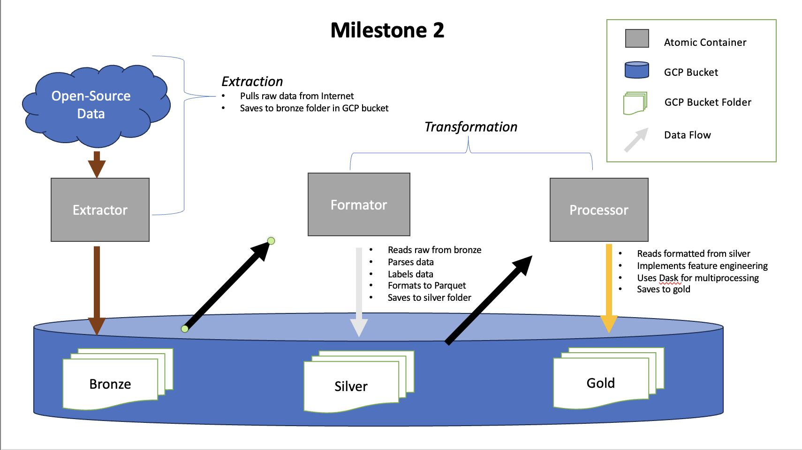

# AC215 - Milestone2 - DGA Classifier
==============================

    ├── LICENSE
    ├── README.md
    ├── etl
        ├── **extracts**
        │   ├── Dockerfile
        │   ├── Pipfile
        │   ├── Pipfile.lock
        │   ├── extract
        │   │   ├── extract.py
        │   │   └── extract.sh
        │   └── secrets
        │       └── removed
        └── **transforms**
            ├── format
            │   ├── Dockerfile
            │   ├── Pipfile
            │   ├── Pipfile.lock
            │   ├── format.py
            │   └── secrets
            │       └── removed
            └── **preprocess**
                ├── Dockerfile
                ├── Pipfile
                ├── Pipfile.lock
                ├── preprocess.py
                └── secrets
                    └── removed

Graphical Representation of M2
------------

--------

**Team Members**
- Rob Chavez
- Naina Garg
- Qian Liu
- Daniel MORE TORRES
- Sophia Yang (She/Her)
  
  

**Group Name**
- CyberSafe

  

**Project**
- In this project we aim to develop an application that can identify the actors associated with domains produced by domain generating algorithms.

  

### Milestone2 ###

We gathered a dataset made up of 31M domains representing 28 unique domain generating algorithms. Our dataset comes from following sources - (1) https://data.mendeley.com/datasets/y8ph45msv8/1 and (2) https://majestic.com/reports/majestic-million ; with approx 650MB in size. We parked our dataset in a private Google Cloud Bucket using an extraction and transformation data pipeline with a custom labeling and versioning.

  

**Extractor container** -- Please go into github repo folder for more details <a href="https://github.com/rob-chavez/ac2152023_cybersafe/tree/milestone2/etl/extracts">here</a>

- This container uses a bash script to extract our data from the sources mentioned above; it then uses a python script to save the data to GCP storage
- Inputs to the container are: (1) GCP project name and (2) a GCP bucket name -- secrets also needed
- Output is raw data saved in GCP bucket/folder provided as a parameter to this container

  

**Formatting container**  -- Please go into github repo folder for more details <a href="https://github.com/rob-chavez/ac2152023_cybersafe/tree/milestone2/etl/transforms/format">here</a>
- This container reads from "bronze" bucket, parses the data, formats the data to parquet, and saves it in chunks (10MB) to a "silver" bucket
- Inputs to the container are: (1) GCP project name (2) a GCP bucket name (3) GCP folder/path name of where to read raw/bronze data (4) GCP folder/path name of where to save formatted/silver data -- secrets also needed
- Output is formatted data saved in GCP bucket/folder provided as a parameter to this container

  

**Preprocessing container**  -- Please go into github repo folder for more details <a href="https://github.com/rob-chavez/ac2152023_cybersafe/tree/milestone2/etl/transforms/preprocess">here</a>
- This container reads from "silver" bucket, implements feature engineering techniques, and saves the processed data to the "gold" bucket
- Inputs to the container are: (1) GCP project name (2) a GCP bucket name (3) GCP folder/path name of where to read formatted/silver data (4) GCP folder/path name of where to save processed/gold data -- secrets also needed
- Output is processed/feature engineered data saved in GCP bucket/folder provided as a parameter to this container
  
