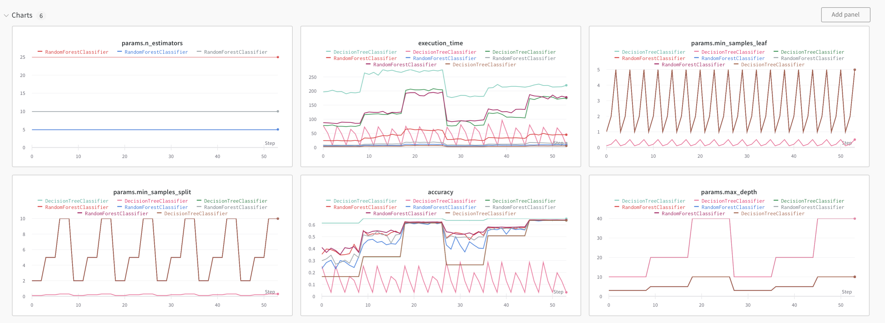
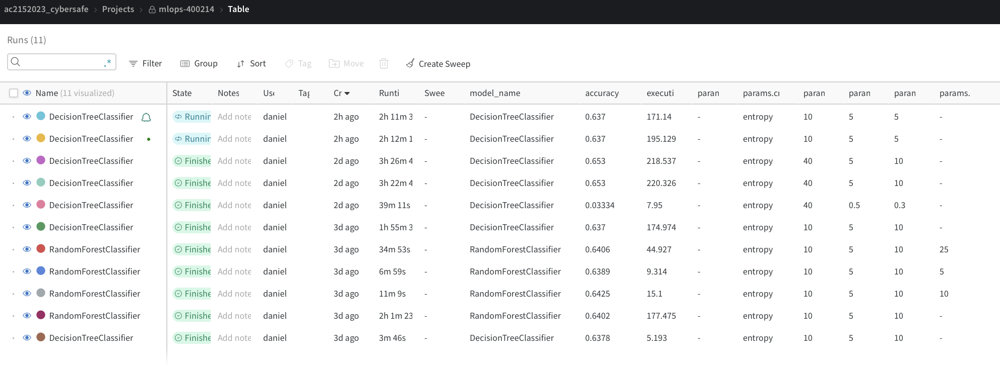

Project Organization
------------
    
    ├── LICENSE
    ├── README.md
    ├── images
    │   ├── vertix.png
    │   ├── wand_model_accuracies.png
    │   └── wandb.png
    ├── notebooks
    │   ├── EDA_and_Model.ipynb
    │   └── model.ipynb
    ├── references
    │   └── Chin2018_Chapter_AMachineLearningFrameworkForSt.pdf
    ├── reports
    │   ├── images
    │   │   ├── extract_transform.png
    │   │   └── updated_extract_transform_pipeline.png
    │   └── milestone2.md
    └── src
        ├── etl
        │   ├── extracts
        │   │   ├── Dockerfile
        │   │   ├── Pipfile
        │   │   ├── Pipfile.lock
        │   │   ├── README.md
        │   │   ├── docker-compose.yml
        │   │   ├── docker.sh
        │   │   ├── extract
        │   │   │   ├── extract.py
        │   │   │   └── extract.sh
        │   │   └── images
        │   │       ├── bucket.png
        │   │       ├── cryptolocker_dga.png
        │   │       ├── dga_domains.png
        │   │       └── extractor_cli.png
        │   └── transforms
        │       ├── format
        │       │   ├── Dockerfile
        │       │   ├── Pipfile
        │       │   ├── Pipfile.lock
        │       │   ├── README.md
        │       │   ├── docker-compose.yml
        │       │   ├── docker.sh
        │       │   ├── format.py
        │       │   └── images
        │       │       ├── formator_container.png
        │       │       ├── read_parquet.png
        │       │       └── silver_output.png
        │       └── preprocess
        │           ├── Dockerfile
        │           ├── Pipfile
        │           ├── Pipfile.lock
        │           ├── README.md
        │           ├── docker-compose.yml
        │           ├── docker.sh
        │           ├── features.py
        │           ├── images
        │           │   ├── gold_output.png
        │           │   ├── processor_container.png
        │           │   └── read_parquet.png
        │           └── preprocess.py
        └── models
            ├── Dockerfile
            ├── LICENSE
            ├── Pipfile
            ├── Pipfile.lock
            ├── cli.sh
            ├── docker-entrypoint.sh
            ├── docker-shell.sh
            ├── package
            │   ├── PKG-INFO
            │   ├── setup.cfg
            │   ├── setup.py
            │   └── trainer
            │       ├── __init__.py
            │       └── task.py
            └── package-trainer.sh
--------

# AC215 - Milestone3 - CyberSafe


**Team Members**
- Rob Chavez
- Naina Garg
- Qian Liu
- Daniel MORE TORRES
- Sophia Yang (She/Her)
  
<br><br>

**Group Name**
- CyberSafe

<br><br>

**Project**
- In this project we aim to develop an application that can identify the actors associated with domains produced by domain generating algorithms.

<br><br>

### Milestone3

The data pipeline for this milestone leverage the work we done for milestone 2.

TFData & TFRecords were not needed for our pipeline, since the models that are giving best results are Sklearn Decision Tree and Random Forest. So we relied on pandas dataframes to fit the models. The pipeline involves reading the data from the Gold folder on the GCP buckets from milestone 2, add OneHotEncoder and split the data in train, test, validation.


Regarding the modeling process, Google denied our request for GPU compute instances. However, since our data is mainly tabular, we decided to only use CPU. We created a Docker container that allows to pass aurgements with the models and parameters to use. We used CMD to run the Serveless training and monitor the results on Weight and Biases.

**Experiment Tracking**

Below you can see the output from our Weights & Biases page. We used this tool to track various possible combinations of parameters of our model training. It was tracked using the `wandb` library we included inside of our `task.py` script. 





**Serverless Training**

Inside our training container, we used the Google Cloud SDK to launch training instances in the cloud. In the image below, you can see several runs of our model. 

To create a new serverless job we did the following commands:


##### Run Container

###### Run `docker-shell.sh`
Based on your OS, run the startup script to make building & running the container easy

This is what your `docker-shell` file will look like:
```
set -e

export IMAGE_NAME=model-training-tree-cli
export BASE_DIR=$(pwd)
export SECRETS_DIR=$(pwd)/../secrets/
export GCS_BUCKET_URI="gs://harvard_mlops_bucketd"
# export GCP_PROJECT="ac215-project"
export GCP_PROJECT="mlops-400214"

echo $BASE_DIR
echo $SECRETS_DIR

# Build the image based on the Dockerfile
#docker build -t $IMAGE_NAME -f Dockerfile .
# M1/2 chip macs use this line
docker build -t $IMAGE_NAME --platform=linux/arm64/v8 -f Dockerfile .

# Run Container
docker run --rm --name $IMAGE_NAME -ti \
-v "$BASE_DIR":/app \
-v "$SECRETS_DIR":/secrets \
-e GOOGLE_APPLICATION_CREDENTIALS=/secrets/model-trainer-tree.json \
-e GCP_PROJECT=$GCP_PROJECT \
-e GCS_BUCKET_URI=$GCS_BUCKET_URI \
-e WANDB_KEY=$WANDB_KEY \
$IMAGE_NAME

```

- Make sure you are inside the `training` folder and open a terminal at this location
- Run `sh docker-shell.sh` on MacOS
- The `docker-shell` file assumes you have the `WANDB_KEY` as an environment variable and is passed into the container


###### Package & Upload Python Code

###### Run `sh package-trainer.sh`
- This script will create a `trainer.tar.gz` file with all the training code bundled inside it
- Then this script will upload this packaged file to your GCS bucket can call it `dga-app-trainer.tar.gz` under the folder tree-trainer


###### Create Jobs in Vertex AI
- Edit your `cli.sh` and change the line related to the model and parameters
- Run `sh cli.sh`

The cli.sh looks like this:

```

# List of prebuilt containers for training
# https://cloud.google.com/vertex-ai/docs/training/pre-built-containers

export UUID=$(openssl rand -hex 6)
export DISPLAY_NAME="dga_training_job_$UUID"
export MACHINE_TYPE="n1-standard-4"
export REPLICA_COUNT=1
export EXECUTOR_IMAGE_URI="us-docker.pkg.dev/vertex-ai/training/tf-gpu.2-12.py310:latest"
export PYTHON_PACKAGE_URI=$GCS_BUCKET_URI/tree-trainer/dga-app-trainer.tar.gz
export PYTHON_MODULE="trainer.task"
export ACCELERATOR_TYPE="NVIDIA_TESLA_T4"
export ACCELERATOR_COUNT=1
export GCP_REGION="us-central1" # Adjust region based on you approved quotas for GPUs

export CMDARGS="--model_name=DecisionTreeClassifier,--wandb_key=$WANDB_KEY"
# export CMDARGS="--model_name=RandomForestClassifier,--n_estimators=10,--wandb_key=$WANDB_KEY"
# export CMDARGS="--model_name=RandomForestClassifier,--n_estimators=5,--wandb_key=$WANDB_KEY"
# export CMDARGS="--model_name=RandomForestClassifier,--n_estimators=25,--wandb_key=$WANDB_KEY"

# Run training with No GPU
export EXECUTOR_IMAGE_URI="us-docker.pkg.dev/vertex-ai/training/tf-cpu.2-12.py310:latest"
gcloud ai custom-jobs create \
  --region=$GCP_REGION \
  --display-name=$DISPLAY_NAME \
  --python-package-uris=$PYTHON_PACKAGE_URI \
  --worker-pool-spec=machine-type=$MACHINE_TYPE,replica-count=$REPLICA_COUNT,executor-image-uri=$EXECUTOR_IMAGE_URI,python-module=$PYTHON_MODULE \
  --args=$CMDARGS
```


###### View Jobs in Vertex AI
- Go to Vertex AI [Custom Jobs](https://console.cloud.google.com/vertex-ai/training/custom-jobs)
- You will see the newly created job ready to be provisioned to run. 


#### Code Structure


**Model Training Container**

- This container contains all data loading, transformation and our training scripts and modeling components. It will use data from a GCP bucket, train, and then output model artifacts (saved model) to a GCP bucket.
- The input for this container is the source bucket for our training data and the output bucket for storing the trained model.
- Output is a saved Sklearn Decision Tree or Randome Forest model.

(1) `src/models/package/trainer//task.py` - This script converts incoming data, applies transformation, and fits the model(s).


**Notebooks** 
This folder contains code that is not part of container - for e.g: EDA :), any 🔍 🕵️‍♀️ 🕵️‍♂️ crucial insights, reports or visualizations.
