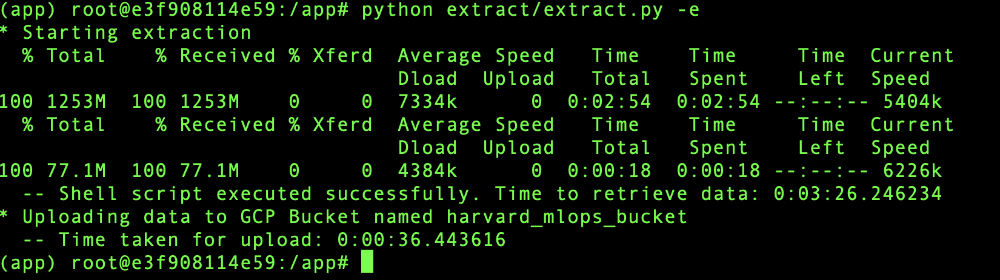
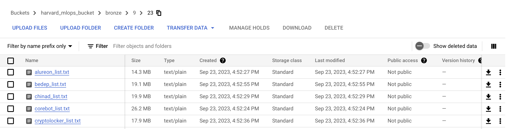
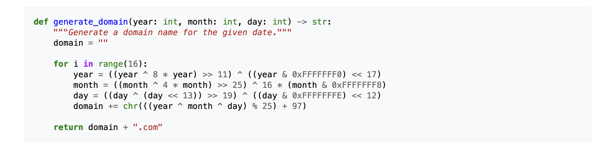
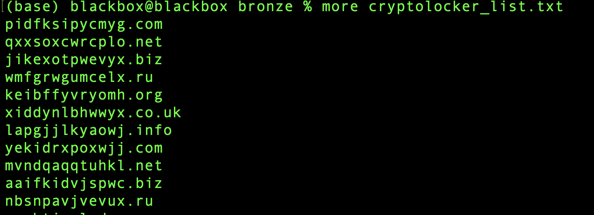

AC215/115 (Milestone2)
==============================

**Extractor container**
------------
- This container uses a bash script to extract our data from open sources; it then uses a python script to save the data to GCP storage
- Inputs to the container are: (1) GCP project name and (2) a GCP bucket name -- secrets also needed
  * As default the GCP project name is mlops and the GCP bucket name is "bronze" with folders representing the month/day
- Output is raw data saved in GCP bucket/folder provided as a parameter to this container

**Details**
------------
The image below demos the execution of the scripts inside the container; it uses a cURL command to reach out to the data repos to pull into
google cloud storage bucket named "harvard_mlops_bucket" and saves in a folder called "bronze"---which represents a raw stage of the data.
It's important to note that for versioning, we use the month and day as a means to create a directory structure inside all of our folders. This provides us with a versioning based on dates when data was saved to the bucket and/or modified. Even though our data is static, we can use this same process to identify new data coming through our pipeline.
     

If you want to run this container in your own VM, you can! You do need to prepare your VM though with a few downloads and set a few environment variables. Here are the list of things you need to do:

(1) curl -fsSL https://get.docker.com -o get-docker.sh

(2) sudo sh get-docker.sh

(3) git clone -- branch milestone2 https://github.com/rob-chavez/ac2152023_cybersafe.git
- enter GitHub username
- enter GitHub API key

(4) cd ac2152023_cybersafe/etl

(5) mkdir secrets

(6) cd secrets

(7) vi harvardmlops.json —-copy and paste keys that give container access to GCP Storage buckets

(8) sudo chmod 644 harvardmlops.json

(9) cd ../extracts

(10) vi ~/.bashrc
- TYPE THE INFO BELOW AT TOP OF FILE: 
- export PATH=“/usr/local/bin/:$PATH”
- export GCP_ZONE=us-east4c4
- export GCP_PROJECT=harvardmlops
- export GCP_BUCKET=harvardmlops
- export GCP_BUCKET_BRONZE_FOLDER=bronze
- export GCP_BUCKET_SILVER_FOLDER=silver
- export GCP_BUCKET_GOLD_FOLDER=gold
- export GOOGLE_APPLICATION_CREDENTIALS=../secrets/harvardmlops.json
- SAVE FILE

(11) source ~/.bashrc

(12) sudo curl -L "https://github.com/docker/compose/releases/download/1.29.2/docker-compose-$(uname -s)-$(uname -m)" -o /usr/local/bin/docker-compose

(13) sudo chmod +x /usr/local/bin/docker-compose

(14) chmod +x docker.sh

(15) sudo chmod 666 /var/run/docker.sock

(16) ./docker.sh

(17) Python extracts/extract.py

Once the script completes, the bronze bucket is filled with our raw data files structured in a way that provides our labels for us;
specifically, the name of the file starts with the hacker_group name and ends with "_list.txt."  A snapshot of the bucket and it's contents
is shown below to provide an example. To provide a further example, if you look at the file named cryptlocker_list.txt below, then the name
of the ransomware actor that created a DGA is named cryptolocker. The contents of that file are domain names that were produced with that
DGA.
     

Shown below is an example of a DGA that cryptolocker uses within its malware:
     

Shown below are domains that such a DGA produces found in the cryptolocker_list.txt file:
     

 

--------
# AC215 - Milestone2 - DGA Classifier
