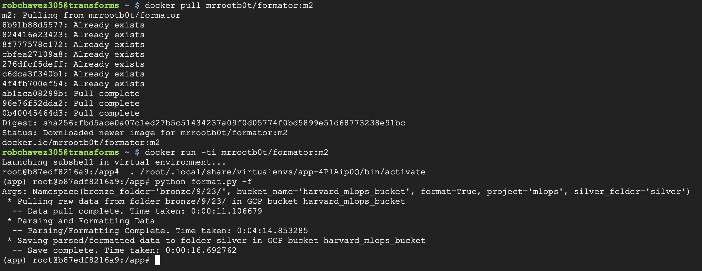
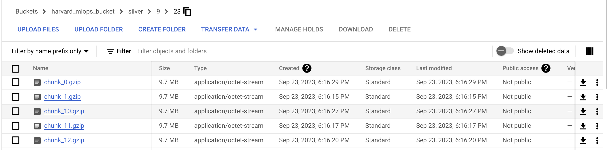
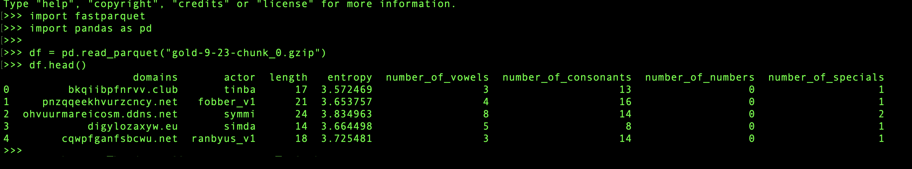

AC215/115 (Milestone2)
==============================

**Formatting container**
------------
- This container reads from the "bronze" bucket, parses the data, formats the data to parquet, and saves it in chunks (10MB) to a "silver" bucket
- Inputs to the container are: (1) GCP project name (2) a GCP bucket name (3) GCP folder/path name of where to read raw/bronze data (4) GCP folder/path name of where to save formatted/silver data -- secrets also needed
- Output is formatted data saved in GCP bucket/folder provided as a parameter to this container

**Details**
------------
The image below demos the execution of the scripts inside a container running on a GCP VM; the container was pulled from docker HUB and uses the parameters detailed
above to **(1)** read the raw data from the bronze folder **(2) **parse and label the data based on the naming convention of the files. As noted in the extraction container 
README.md, the naming convention of files consists of (a) naming the hacker group that created the dga and (b) ending in "_list.txt". All of the domains in the each
repective file are the domains that were produced from the hacker group's domain generation algorithm. **(3)** shuffle the data (4) chunk the data; a single file of 644MB 
is not terribly large but we break the files up so that we can use DASK in future pre-preprocessing. (5) Finally, we save the data chunks to the silver folder or formatted
data of the GCP bucket called "harvard_mlops_bucket" as parquet files, which is a columnar format that Dask does well with for multiprocessing.   As noted in the extraction container README.md, we use the current month and day as a method of versioning for our data. 
     

If you want to run this container on a VM, follow the steps below:

(1) curl -fsSL https://get.docker.com -o get-docker.sh

(2) sudo sh get-docker.sh

(3) git clone -- branch milestone2 https://github.com/rob-chavez/ac2152023_cybersafe.git
- enter GitHub username
- enter GitHub API key

(4) cd ac2152023_cybersafe/etl

(5) mkdir secrets

(6) cd secrets

(7) vi harvardmlops.json —-copy and paste keys that give container access to GCP Storage buckets

(8) sudo chmod 644 harvardmlops.json

(9) cd ../transforms/format

(10) vi ~/.bashrc
- TYPE THE INFO BELOW AT TOP OF FILE: 
- export PATH=“/usr/local/bin/:$PATH”
- export GCP_ZONE=us-east4c4
- export GCP_PROJECT=harvardmlops
- export GCP_BUCKET=harvardmlops
- export GCP_BUCKET_BRONZE_FOLDER=bronze
- export GCP_BUCKET_SILVER_FOLDER=silver
- export GCP_BUCKET_GOLD_FOLDER=gold
- export GOOGLE_APPLICATION_CREDENTIALS=../../secrets/harvardmlops.json
- SAVE FILE

(11) source ~/.bashrc

(12) sudo curl -L "https://github.com/docker/compose/releases/download/1.29.2/docker-compose-$(uname -s)-$(uname -m)" -o /usr/local/bin/docker-compose

(13) sudo chmod +x /usr/local/bin/docker-compose

(14) chmod +x docker.sh

(15) sudo chmod 666 /var/run/docker.sock

(16) ./docker.sh

Once the script completes, the silver folder in the GCP bucket is filled with our formatted data saved as parquet files. The image below provides
a snapshot of the bucket/folder as seen on GCP. 
     

We use gzip compression for saving our parquet files. An example of how to load this data as a pandas dataframe is shown in the image below.
     

 

--------
# AC215 - Milestone2 - DGA Classifier
