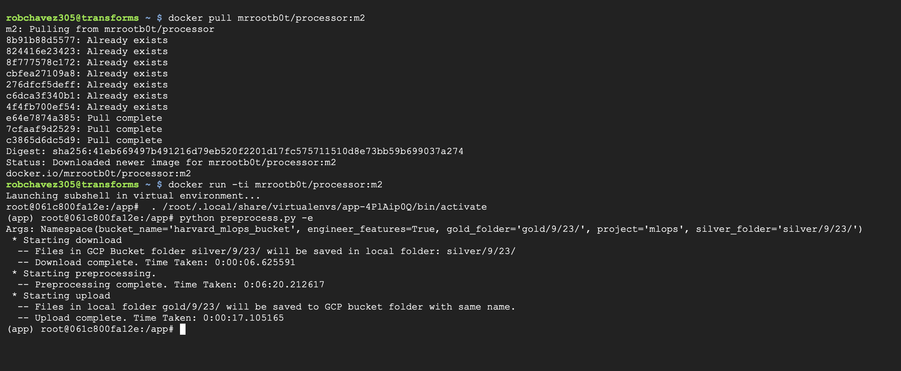
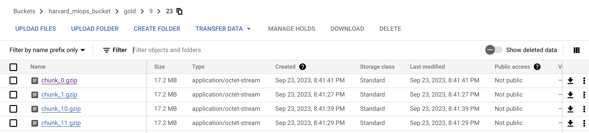
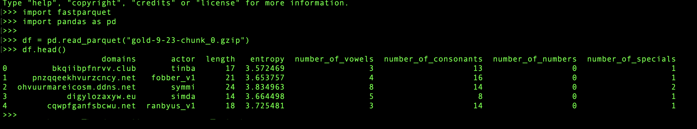

AC215/115 (Milestone2)
==============================

**Preprocessing container**
------------
- This container reads from "silver" bucket, implements feature engineering techniques, and saves the processed data to the "gold" bucket
- Inputs to the container are: (1) GCP project name (2) a GCP bucket name (3) GCP folder/path name of where to read formatted/silver data (4) GCP folder/path name of where to save processed/gold data -- secrets also needed
- Output is processed/feature engineered data saved in GCP bucket/folder provided as a parameter to this container

**Details**
------------
The image below demos the execution of the script inside a container running on a GCP VM; the container was pulled from docker HUB and uses the parameters detailed above to **(1)** read formatted parquet files from the silver folder **(2) process each record through a feature engineering pipeline that uses dask and multiprocessing for each file using four cores to process each of the 40 some files **(3)** saves the processed files into a gold folder found in the "harvard_mlops_bucket." As noted in the extraction container README.md, we use the current month and day as a method of versioning for our data. 
     

Once the script completes, the gold folder in the GCP bucket is filled with our processed/engineered data saved as parquet files. The image below provides a snapshot of the bucket/folder as seen on GCP. 
     

We use gzip compression for saving our parquet files. An example of how to load this data as a pandas dataframe is shown in the image below.
     

 

--------
# AC215 - Milestone2 - DGA Classifier
